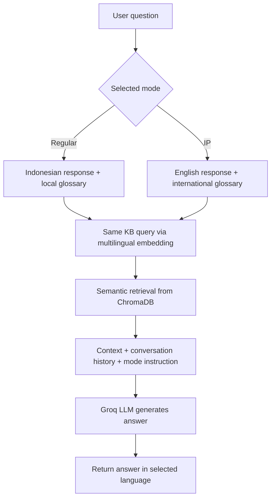

# Log Perubahan Chatbot Akademik Informatika UII Berbasis RAG

Dokumen ini mencatat perubahan arsitektur, kode, model, basis pengetahuan, dan fitur selama pengembangan chatbot layanan akademik Informatika UII. Log ini disusun berdasarkan dokumentasi teknis proyek, riwayat Git, serta perubahan kode yang terdapat pada repository.

> **Aturan pemeliharaan:** Setiap perubahan baru pada kode, arsitektur, model, konfigurasi, knowledge base, fitur, atau pengujian wajib dicatat pada dokumen ini setelah perubahan tersebut diimplementasikan dan divalidasi.

## 1. Identitas Proyek

| Item | Keterangan |
|---|---|
| Nama proyek | Chatbot Layanan Informasi Akademik Program Studi Informatika UII |
| Peneliti | Daviar Andrianoe Arhaburizky |
| NIM | 23523193 |
| Program studi | Informatika - Program Sarjana, Fakultas Teknologi Industri, UII |
| Metode utama | Retrieval-Augmented Generation (RAG) |
| Arsitektur | Three-Tier Architecture |
| Frontend | PHP, Tailwind CSS, Vanilla JavaScript |
| Middleware | Python Flask REST API |
| Vector store | ChromaDB Persistent Client lokal |
| Embedding | `paraphrase-multilingual-MiniLM-L12-v2` |
| LLM inference | Groq Cloud API |

## 2. Arsitektur Sistem Saat Ini

```text
Frontend index.php
    |
    | HTTP POST /chat melalui 127.0.0.1:5000
    v
Middleware app.py (Flask)
    |
    | Embedding query dan semantic retrieval
    v
ChromaDB lokal (./chroma_db)
    |
    | Lima dokumen paling relevan
    v
Groq Cloud API
    |
    | LLM menyusun jawaban berdasarkan konteks dokumen
    v
Jawaban JSON kembali ke Floating Chat Widget
```

Sistem menggunakan dua tahap utama:

1. **Ingesti offline**: `ingest.py` membaca file JSON pada folder `KnowledgeBase`, menggabungkan pertanyaan dan jawaban, membuat embedding, lalu menyimpan dokumen beserta metadata ke ChromaDB.
2. **Interaksi online**: `app.py` menerima pertanyaan, melakukan retrieval semantik, menyusun system prompt, memanggil Groq, dan mengembalikan jawaban ke `index.php`.

## 3. Matriks Perubahan Arsitektur

| Tanggal/Versi | Komponen yang Diubah | Kondisi Sebelumnya | Kondisi Setelah Perubahan | Alasan/Urgensi |
|---|---|---|---|---|
| 2026-04-25 / `0a30662` | Fondasi sistem | Belum terdapat pipeline RAG terpadu | ChromaDB, Flask, endpoint `/chat`, dan frontend PHP mulai diintegrasikan | Membentuk alur dasar retrieval dan generation yang dapat diuji end-to-end |
| 2026-04-25 / `25f263e` | LLM inference | Eksperimen menggunakan layanan/model Gemini | Integrasi Groq Cloud API | Mengurangi kendala kuota dan rate limit pada layanan sebelumnya serta memperoleh waktu generasi yang lebih rendah |
| 2026-04-25 / `25f263e` | Model LLM awal | Model Gemini pada tahap eksperimen | `llama-3.1-8b-instant` digunakan pada implementasi awal Groq | Model dipilih karena ringan dan cepat pada tahap awal pengujian |
| 2026-04-26 / `572d5f5` | Model embedding | `all-MiniLM-L6-v2` | `paraphrase-multilingual-MiniLM-L12-v2` | Meningkatkan pemetaan semantic search untuk Bahasa Indonesia, sinonim, singkatan, dan istilah akademik lokal |
| 2026-04-26 / `572d5f5` | Ingesti data | Koleksi dan dokumen menggunakan konfigurasi embedding lama | `ingest.py` memakai model multilingual, reset koleksi, serta ID dinamis | Menjaga embedding pada proses ingest dan query tetap konsisten serta mencegah data lama/duplikat |
| 2026-04-26 / `572d5f5` | Kedalaman retrieval | `n_results=3` | `n_results=5` | Menambah cakupan konteks untuk pertanyaan yang membutuhkan beberapa fakta |
| 2026-04-26 / `572d5f5` | Identitas dokumen | ID sederhana seperti `id_0` | ID dinamis `doc_{source}_{file}_{count}` | Mengurangi risiko benturan ID ketika data berasal dari banyak folder dan file |
| 2026-04-26 / `572d5f5` | Siklus ingesti | Data lama dapat tertinggal pada koleksi | Koleksi `akademik_uii` dihapus lalu dibuat kembali sebelum ingest | Menerapkan pendekatan fresh start agar data kedaluwarsa tidak tercampur |
| 2026-06-22 / `163ca4c` | Basis pengetahuan | Data akademik masih terbatas | Knowledge base modular ditambahkan, termasuk profil, kurikulum, kemitraan, panduan Key-In, dan Key-in Talks | Memperluas cakupan pertanyaan faktual dan troubleshooting akademik |
| 2026-07-24 | Dokumentasi teknis | Penjelasan arsitektur tersebar pada kode dan catatan | Dokumen `Dokumentasi Teknis dan Arsitektur Kode Chatbot RAG.docx` digunakan sebagai acuan dokumentasi | Menyediakan dasar penulisan bab implementasi dan rencana pengujian |
| 2026-09-18 / `8832f27` | Latar antarmuka | Widget belum menggunakan latar halaman resmi | Background resmi ditambahkan pada full canvas melalui `Background/Background.png` | Menyesuaikan identitas visual Informatika UII tanpa mengganggu widget chat |
| 2026-09-18 | LLM inference aktif | `llama-3.1-8b-instant` dipanggil secara hard-coded | Default diganti menjadi `qwen/qwen3.8-27b` melalui variabel `GROQ_MODEL` | Groq mengembalikan `404 model_not_found` untuk model lama; model aktif harus digunakan agar endpoint kembali berjalan |
| 2026-09-18 | Percakapan kontekstual | API hanya menerima pertanyaan terbaru | API menerima `conversation_history` dan mempertahankan maksimal 10 pesan yang valid | Memungkinkan chatbot memahami jawaban klarifikasi seperti angkatan, semester, kelas, dan periode akademik |
| 2026-09-18 | Retrieval follow-up | Query retrieval hanya berisi pertanyaan terbaru | Query retrieval menggabungkan pertanyaan pengguna sebelumnya dengan pertanyaan terbaru | Memastikan jawaban lanjutan tetap menemukan dokumen yang berkaitan dengan pertanyaan awal |
| 2026-09-18 | System prompt | Instruksi hanya berisi persona dan konteks dokumen | Ditambahkan aturan pertanyaan umum, klarifikasi konteks, pembedaan angkatan/semester, dan batasan jawaban | Mengurangi salah tafsir pada jadwal Key-In, kurikulum, pendadaran, remedi, dan penjaluran |
| 2026-09-18 | Endpoint frontend | `http://localhost:5000/chat` | `http://127.0.0.1:5000/chat` | Menghindari potensi latensi resolusi nama host lokal pada Windows |
| 2026-09-18 | Format jawaban UI | Markdown dari LLM tampil mentah sebagai karakter `*` | Formatter frontend menampilkan paragraf, teks tebal/miring, daftar bernomor, dan bullet list | Meningkatkan keterbacaan jawaban pada floating widget berukuran kecil |

## 4. Catatan Perubahan Per Komponen

### 4.1 `ingest.py`

Perubahan dan fungsi utama:

- Menetapkan `BASE_DIR`, `KB_DIR`, dan `CHROMA_DATA_PATH` berdasarkan lokasi file Python.
- Menggunakan `PersistentClient` agar vector store tersimpan pada folder lokal `chroma_db`.
- Menggunakan embedding `paraphrase-multilingual-MiniLM-L12-v2`.
- Menghapus koleksi `akademik_uii` sebelum ingest ulang melalui `delete_collection`.
- Membuat koleksi baru dengan embedding function yang sama.
- Memindai file `.json` secara rekursif pada folder `KnowledgeBase`.
- Mendukung struktur JSON berupa list objek maupun list yang berisi list objek.
- Mengambil pasangan `question` dan `answer` yang tidak kosong.
- Menggabungkan pasangan tersebut menjadi dokumen:

  ```text
  Pertanyaan: {question}
  Jawaban: {answer}
  ```

- Menyimpan metadata `source`, `file`, dan `question`.
- Membuat ID dinamis dengan pola:

  ```text
  doc_{source_name}_{file}_{count}
  ```

### 4.2 `app.py`

Perubahan dan fungsi utama:

- Menyediakan endpoint `POST /chat` menggunakan Flask.
- Mengaktifkan CORS agar frontend PHP dapat mengakses API Flask.
- Memuat `GROQ_API_KEY` dari `.env`.
- Menambahkan konfigurasi model:

  ```python
  GROQ_MODEL = os.getenv("GROQ_MODEL", "qwen/qwen3.8-27b")
  ```

- Menggunakan embedding yang sama dengan proses ingest.
- Mengambil lima dokumen teratas melalui `n_results=5`.
- Memvalidasi JSON menggunakan `request.get_json(silent=True) or {}`.
- Menolak query kosong dengan HTTP 400.
- Menerima `conversation_history` dan hanya memproses role `user` serta `assistant` dengan isi yang valid.
- Menggabungkan pertanyaan pengguna sebelumnya dengan pertanyaan terbaru untuk query retrieval.
- Menyertakan riwayat percakapan dan konteks dokumen pada system prompt.
- Menginstruksikan model untuk membedakan pertanyaan umum dan pertanyaan yang membutuhkan konteks akademik.
- Meminta klarifikasi apabila semester, angkatan, kelas Reguler/IP, atau periode akademik belum tersedia.
- Mengembalikan `answer` dan `sources` dalam format JSON.

### 4.3 `index.php`

Perubahan dan fungsi utama:

- Mengubah halaman menjadi Floating Chat Widget.
- Menambahkan tombol toggle dan tombol close.
- Menambahkan pencegahan double request dengan `submitBtn.disabled = true` selama request berjalan.
- Menampilkan animasi tiga titik ketika menunggu respons API.
- Menyimpan riwayat percakapan sementara dalam `conversationHistory`.
- Mengirim maksimal sepuluh pesan historis yang relevan ke endpoint `/chat`.
- Mengirim request ke `127.0.0.1` untuk menghindari resolusi `localhost`.
- Menambahkan formatter jawaban AI untuk mengubah markdown dasar menjadi elemen HTML.
- Melakukan escaping terhadap pesan sebelum dirender sebagai HTML.
- Menambahkan styling untuk paragraf, daftar bernomor, bullet list, dan teks tebal.
- Menambahkan background resmi pada halaman penuh menggunakan `Background/Background.png`.

## 5. Perubahan Model dan Konfigurasi API

### 5.1 Pergantian LLM

Pada tahap awal, proyek bereksperimen dengan Gemini. Implementasi kemudian berpindah ke Groq Cloud API. Model Groq awal yang digunakan adalah `llama-3.1-8b-instant`.

Pada 18 September 2026, pengujian endpoint menghasilkan error:

```text
404 model_not_found
The model `llama-3.1-8b-instant` does not exist or you do not have access to it.
```

API key terbukti terbaca dan request berhasil mencapai Groq. Masalah berada pada ketersediaan model, bukan pada proses retrieval lokal. Model aktif kemudian diperiksa melalui daftar model Groq dan `qwen/qwen3.8-27b` dipilih sebagai default.

Konfigurasi saat ini:

```env
GROQ_MODEL=qwen/qwen3.8-27b
```

Variabel `GROQ_MODEL` bersifat opsional karena kode memiliki default yang sama. Untuk deployment, model sebaiknya tetap ditulis eksplisit pada `.env` agar versi model yang dipakai tercatat jelas.

### 5.2 Pergantian Embedding

Embedding awal `all-MiniLM-L6-v2` diganti menjadi `paraphrase-multilingual-MiniLM-L12-v2`. Pergantian ini berlaku pada `ingest.py` dan `app.py`, sehingga dokumen dan query menggunakan ruang vektor yang sama.

Model multilingual dipilih karena chatbot memproses Bahasa Indonesia, istilah akademik lokal, singkatan, dan variasi bahasa pengguna. Setelah model embedding diganti, koleksi ChromaDB harus dibuat ulang melalui `python ingest.py`.

## 6. Struktur Basis Pengetahuan

Knowledge base dipisahkan secara modular agar sumber informasi mudah dirawat dan diperbarui.

| Modul | Isi utama |
|---|---|
| `KnowledgeBaseInformaticsUII` | Profil prodi, sejarah, visi-misi, pimpinan, dosen, laboratorium, dan kemitraan |
| `KnowledgeBaseKeyInTalk` | Pertanyaan dan jawaban operasional mahasiswa selama Key-In |
| `KnowledgeBasePanduanKeyIn` | Jadwal, aturan, paket mata kuliah, syarat, dan prosedur Key-In |
| `KnowledgeBasePenjelasanAkademikIF` | Penjelasan akademik Informatika |

Pada hasil ingest terakhir, koleksi `akademik_uii` berisi 443 dokumen. Jumlah ini dapat berubah apabila file JSON diperbarui atau proses ingest dijalankan kembali.

## 7. Alur Conversational Clarification

Alur klarifikasi ditambahkan untuk memenuhi kebutuhan pertanyaan yang dapat memiliki jawaban berbeda berdasarkan profil akademik mahasiswa.

```text
Pertanyaan masuk
    |
    +-- Pertanyaan umum?
    |       |
    |       +-- Ya: jawab langsung berdasarkan konteks dokumen
    |
    +-- Tidak: periksa riwayat percakapan
            |
            +-- Konteks tersedia: jawab sesuai konteks
            |
            +-- Konteks belum tersedia: minta informasi yang kurang
```

Contoh konteks yang dapat diminta:

- Angkatan atau tahun masuk.
- Semester saat ini.
- Kelas atau jalur Reguler/IP.
- Tahun akademik dan periode Ganjil/Genap.
- Jenis Key-In: reguler, revisi, atau penjaluran.
- Status pembayaran atau status penjaluran bila relevan.

Data konteks hanya disimpan di memori JavaScript selama sesi halaman aktif. Belum ada penyimpanan profil pengguna secara permanen ke database.

## 7.1 Arsitektur Regular vs International Program (Satu KB, Mode Runtime)

Pada tahap implementasi berikutnya, proyek memutuskan untuk mempertahankan satu sumber kebenaran basis pengetahuan (single source of truth) dan membedakan keluaran jawaban berdasarkan mode runtime yang dipilih pengguna. Keputusan ini dibuat agar basis data tidak bercabang menjadi dua KB terpisah yang berisiko menghasilkan data yang tidak konsisten.

- Mode Regular: jawaban dalam Bahasa Indonesia, dengan istilah lokal seperti Key-In, DPA, Prodi, Gateway, Sekawan, dan klasifikasi Reguler/IP dipertahankan sesuai konteks.
- Mode International Program: jawaban dalam Bahasa Inggris, dengan terminologi akademik yang lebih umum tetapi tetap mempertahankan nama resmi lokal bila diperlukan.
- Retrieval tetap menggunakan embedding multilingual yang sama di seluruh koleksi ChromaDB, sehingga query yang masuk dalam Bahasa Indonesia atau Bahasa Inggris tetap dapat menemukan konteks yang relevan.
- Glosarium lokal dipasang di system prompt agar istilah akrab mahasiswa tidak terdistorsi selama response generation.

### Flowchart arsitektur mode runtime



Dengan skema ini, tidak ada duplikasi pengetahuan, tidak ada pemisahan koleksi yang tidak selaras, dan semua pertanyaan tetap dapat dijalankan dengan satu knowledge base tunggal yang kemudian diterjemahkan secara runtime sesuai kebutuhan mode pengguna.

### 7.2 Metadata KB dan filter retrieval mode

Pada pengembangan lanjutan, koleksi ChromaDB ditingkatkan dengan metadata pembantu untuk menjaga traceability dan memperkuat pengelolaan basis pengetahuan tanpa membagi data menjadi dua koleksi terpisah. Setiap dokumen memiliki metadata berikut:

- `source`: nama folder sumber data
- `file`: nama file JSON asal
- `question`: pertanyaan utama yang menjadi inti dokumen
- `language`: status bahasa dokumen, dinilai sebagai `multilingual` untuk KB yang umum dipakai di dua mode
- `program_scope`: `all`, `regular`, atau `ip`
- `topic`: klasifikasi topik seperti `panduan_keyin`, `profil_prodi`, `keyin_talk`, atau `penjelasan_akademik`
- `subtopic`: subkategori tambahan untuk pengorganisasian dokumen
- `period`: `ganjil`, `genap`, atau `all`

Metadata ini memungkinkan retrieval lebih terarah dan memudahkan traceability ketika kebutuhan evaluasi, debugging, atau pengujian lanjutan muncul.

### 7.3 Penguatan glossary istilah lokal

Pada tahap berikutnya, penguatan glossary dipasang sebagai lapisan tambahan untuk menjaga konsistensi terminologi lokal selama generation. Istilah-Isilah seperti `Key-In`, `DPA`, `Prodi`, `Gateway`, `Sekawan`, `MKWU`, `UIIRAS`, serta konteks `Regular` dan `International Program` tidak lagi dipahami secara bebas oleh model, melainkan dibingkai ulang ke dalam definisi yang konsisten sesuai mode aktif.

Implementasi glossary dilakukan dengan tiga mekanisme:

1. `LOCAL_GLOSSARY`: kamus definisi untuk istilah lokal dan terjemahan teknis lintas mode.
2. `build_glossary_prompt(mode)`: menyisipkan definisi glosarium ke dalam system prompt agar model selalu memadukan istilah lokal yang benar sesuai mode.
3. `expand_query_with_glossary(query, mode)`: menambahkan deskripsi singkat istilah yang muncul pada query agar retrieval tetap terarah pada konteks yang tepat.

Tujuan utama dari penguatan glossary ini adalah menjaga agar istilah lokal UII tidak berubah makna saat mode `Regular` atau `IP` dipilih, sekaligus mencegah output LLM yang terlalu umum atau terlalu mengubah istilah yang seharusnya tetap dipertahankan sesuai konteks akademik.

## 8. Pengujian yang Telah Dilakukan

| Pengujian | Hasil |
|---|---|
| Compile Python `app.py` | Berhasil menggunakan `python -m py_compile app.py` |
| Pemeriksaan whitespace | Berhasil menggunakan `git diff --check` |
| Pemeriksaan JavaScript inline | Berhasil menggunakan parser `new Function` pada dua script block |
| Pemeriksaan endpoint setelah pergantian model | Berhasil, HTTP 200 dan field `answer` tersedia |
| Retrieval collection | Berhasil, koleksi berisi 443 dokumen |
| Uji semantic retrieval pertanyaan mitra | Dokumen kemitraan berada pada hasil teratas dengan distance 0.2672 |
| Uji semantic retrieval SKS kelulusan | Dokumen beban studi berada pada hasil teratas dengan distance 0.2721 |
| Uji semantic retrieval jadwal revisi | Dokumen jadwal Key-In revisi berada pada hasil teratas dengan distance 0.1179 |
| Uji semantic retrieval pertanyaan semester/kelas | Dokumen rekomendasi kelas FSD semester 3 berada pada hasil teratas dengan distance 0.2404 |

### 8.1 Pengujian skenario nyata mahasiswa

Pengujian tambahan dilakukan melalui Flask test client dengan enam skenario yang meniru pola pertanyaan mahasiswa. Setiap request menggunakan endpoint `POST /chat`, knowledge base lokal, conversation history, dan mode yang sesuai.

| Skenario | Mode | Hasil | Catatan |
|---|---|---|---|
| Pertanyaan jadwal Key-In tanpa periode | Regular | HTTP 200 | Chatbot menyebut tanggal yang tersedia dalam dokumen dan menjelaskan bahwa jadwal lengkap belum tercantum. |
| Jawaban lanjutan berisi angkatan 2025 dan periode Ganjil | Regular | HTTP 200 | Riwayat percakapan digunakan; chatbot membatasi jawaban pada informasi Ganjil 2025/2026 yang tersedia. |
| Pertanyaan istilah DPA dan hubungannya dengan Key-In | Regular | HTTP 200 | Glossary dan dokumen mendukung jawaban bahwa DPA berarti Dosen Pembimbing Akademik dan berperan dalam konsultasi Key-In. |
| Pertanyaan prosedur registrasi mata kuliah tanpa detail konteks | IP | HTTP 200 | Chatbot menjawab dalam Bahasa Inggris dan tidak mengarang langkah yang tidak tersedia dalam dokumen. |
| Follow-up IP dengan semester pertama dan periode Ganjil | IP | HTTP 200 | Riwayat dan glossary dipertahankan; chatbot menyarankan Prodi/DPA karena prosedur spesifik IP tidak tersedia. |
| Pertanyaan di luar domain tentang juara Liga Champions | Regular | HTTP 200 | Chatbot menolak menjawab di luar pedoman akademik Informatika UII. |

Pengujian menunjukkan bahwa mode bahasa, glossary lokal, pembatasan domain, dan percakapan lanjutan berjalan pada seluruh skenario dengan status HTTP 200. Pertanyaan jadwal yang masih umum perlu menjadi perhatian evaluasi lanjutan karena dokumen dapat memuat beberapa tanggal dari periode berbeda; chatbot sudah menyatakan keterbatasan konteks, tetapi ketepatan klarifikasi periode tetap perlu diuji dengan dataset yang lebih besar.

## 9. Catatan Validasi dan Hal yang Perlu Diperbarui

Bagian ini penting untuk menjaga kesesuaian antara laporan dan implementasi aktual.

1. **Model LLM pada dokumentasi lama perlu diperbarui.** Dokumen Word menyebut `llama-3.1-8b-instant` sebagai model final, tetapi implementasi terbaru menggunakan `qwen/qwen3.8-27b` karena model lama tidak tersedia pada akun Groq saat pengujian.
2. **Metrik ChromaDB perlu diverifikasi.** Pemeriksaan terhadap koleksi aktif menunjukkan `collection.metadata` bernilai `None`. Karena koleksi dibuat tanpa `metadata={"hnsw:space": "cosine"}`, nilai retrieval yang tampil saat ini tidak boleh langsung dilaporkan sebagai cosine similarity tanpa verifikasi tambahan.
3. **Dokumentasi lama menyebut koleksi `informatika_uii` pada bagian ingesti, sedangkan kode aktif menggunakan `akademik_uii`.** Nama koleksi pada laporan harus mengikuti kode yang benar-benar digunakan saat eksperimen final.
4. **Jumlah file knowledge base pada dokumen Word perlu diselaraskan dengan repository.** Repository saat ini memiliki beberapa file JSON untuk periode Ganjil dan Genap, bukan hanya lima file utama.
5. **Tanggal jadwal pada knowledge base bersifat periodik.** Data Ganjil 2025/2026 dan Genap 2025/2026 perlu diberi penanda periode ketika digunakan pada pengujian agar hasil tidak dianggap berlaku untuk semua tahun akademik.
6. **API key tidak dicatat dalam dokumen ini.** Nilai rahasia harus tetap berada di `.env`, tidak dimasukkan ke Git, dan sebaiknya diregenerasi apabila pernah terekspos.

## 10. Rekomendasi untuk Bab Implementasi dan Pengujian

Untuk laporan skripsi, perubahan berikut sebaiknya dijelaskan dan dibuktikan dengan eksperimen:

- Bandingkan retrieval embedding `all-MiniLM-L6-v2` dan `paraphrase-multilingual-MiniLM-L12-v2` menggunakan pertanyaan Bahasa Indonesia yang sama.
- Gunakan dataset uji yang memiliki pertanyaan umum, pertanyaan kontekstual, paraphrase, singkatan, typo, dan pertanyaan di luar domain.
- Laporkan Top-1/Top-5 relevance, bukan hanya distance, karena distance tidak otomatis sama dengan akurasi jawaban.
- Ukur latensi retrieval lokal dan latensi generasi Groq secara terpisah.
- Uji percakapan dua langkah, misalnya pertanyaan jadwal Key-In diikuti jawaban angkatan dan kelas.
- Uji pertanyaan yang tidak menyebut konteks dan pastikan chatbot meminta klarifikasi sebelum memberi jawaban spesifik.
- Uji out-of-domain untuk memastikan chatbot tidak mengarang informasi di luar knowledge base.
- Catat model LLM, embedding, jumlah dokumen, tanggal ingest, `n_results`, temperature, dan konfigurasi environment pada setiap eksperimen.

## 11. Perintah Operasional

### Ingest ulang knowledge base

```powershell
python ingest.py
```

### Menjalankan Flask API

```powershell
python app.py
```

### Konfigurasi environment minimal

```env
GROQ_API_KEY=<isi-api-key-yang-valid>
GROQ_MODEL=qwen/qwen3.8-27b
```

## 12. Status Saat Ini

| Area | Status |
|---|---|
| Pipeline RAG lokal | Berfungsi |
| Ingest JSON modular | Berfungsi |
| Embedding multilingual | Aktif |
| Retrieval lima dokumen | Aktif |
| Groq Cloud generation | Berfungsi dengan model aktif |
| Conversational clarification | Diimplementasikan melalui riwayat sesi |
| Pencegahan double request | Aktif |
| Formatter jawaban markdown dasar | Aktif |
| Validasi cosine metric ChromaDB | Belum difinalkan |
| Pengujian kuantitatif 30 pertanyaan | Belum difinalkan |
| Pengujian latensi 50 request | Belum difinalkan |
| Pengujian factuality/hallucination | Belum difinalkan |